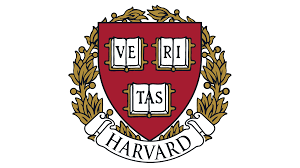

# Harvard_CS50AI_Projects

  

This repository contains all 12 projects completed as part of the [**CS50’s Introduction to Artificial Intelligence with Python**](https://cs50.harvard.edu/ai/2024/) offered by Harvard University through OpenCourseWare.  
The course explores foundational concepts in Artificial Intelligence including search, knowledge representation, uncertainty, optimization, learning, and natural language processing — all implemented in Python.

---

## 📘 Project Overview

---

### 📁 `project_1_degrees` - Degrees of Separation  
> Implements a search algorithm to determine how many [degrees of separation](https://en.wikipedia.org/wiki/Six_degrees_of_separation) exist between two actors, using a movie-star graph.

Covers:
- Search problems
- Breadth-first search (BFS)
- Node/edge modeling

---

### 📁 `project_2_TicTacToe` - Tic Tac Toe AI  
> Builds an unbeatable AI player for [Tic-Tac-Toe](https://en.wikipedia.org/wiki/Tic-tac-toe) using the [Minimax algorithm](https://youtu.be/WbzNRTTrX0g?t=4321).

Covers:
- Game trees
- Minimax
- Optimal move selection

  

---

### 📁 `project_3_Knights` - Knights and Knaves  
> Constructs a knowledge base to solve logical puzzles inspired by Raymond Smullyan’s "Knights and Knaves".

Covers:
- Propositional logic
- Model checking
- Logical inference

---

### 📁 `project_4_Minesweeper` - Minesweeper AI  
> Implements an AI to play the classic [Minesweeper](https://en.wikipedia.org/wiki/Minesweeper_(video_game)) game using logic and inference.

Covers:
- Knowledge representation
- Logical constraints
- Safe move inference

---

### 📁 `project_05_Heredity` - Genetic Inheritance  
> Uses [Bayesian Networks](https://en.wikipedia.org/wiki/Bayesian_network) to determine the probability of individuals carrying a gene and exhibiting a trait.

Covers:
- Conditional probability
- Joint probability distribution
- Normalization and inference

---

### 📁 `project_06_PageRank` - Page Ranking Algorithms  
> Simulates the behavior of a [random surfer](https://cs50.harvard.edu/ai/2024/projects/2/pagerank/#random-surfer-model) and implements the iterative [PageRank](https://en.wikipedia.org/wiki/PageRank) algorithm.

Covers:
- Markov Chains
- Transition models
- Iterative convergence

---

### 📁 `project_07_CrossWord` - Crossword Generator  
> Solves and generates crossword puzzles by applying constraint satisfaction and backtracking.

Covers:
- Constraint Satisfaction Problems (CSPs)
- Backtracking search
- Domain reduction and consistency

---

### 📁 `project_08_Shopping` - Shopping Prediction  
> Uses supervised learning to predict whether online shoppers will complete a purchase based on browsing session data.

Covers:
- Data preprocessing
- k-Nearest Neighbors (k-NN)
- Model evaluation (TPR/TNR)

---

### 📁 `project_09_Nim` - Reinforcement Learning on Nim  
> Develops an AI to play the game of [Nim](https://en.wikipedia.org/wiki/Nim) using Q-learning through self-play.

Covers:
- Reinforcement learning
- Q-values and policy updates
- Exploration vs. exploitation

---

### 📁 `project_10_Traffic` - Traffic Sign Classification  
> Trains a [Convolutional Neural Network](https://en.wikipedia.org/wiki/Convolutional_neural_network) to recognize traffic signs from the [GTSRB dataset](https://benchmark.ini.rub.de/).

Covers:
- Deep learning with TensorFlow/Keras
- Image classification
- Overfitting and regularization

---

### 📁 `project_11_Attention` - Masked Language Modeling  
> Uses [BERT](https://arxiv.org/abs/1810.04805) and the `transformers` library to predict masked words and visualize [attention mechanisms](https://cs50.harvard.edu/ai/2024/projects/6/attention/).

Covers:
- Transformer architecture
- Pre-trained models
- Token masking and attention visualization

---

### 📁 `project_12_parser` - Sentence Parser  
> Parses English sentences to identify their grammatical structure and extract noun phrase chunks.

Covers:
- Context-Free Grammar (CFG)
- [NLTK](https://www.nltk.org/)
- Syntax trees and parsing

---

## 🛡️ Disclaimer

This repository was created for educational purposes only and reflects my learning journey through Harvard’s CS50AI course.  
Please avoid plagiarism and refer to the [CS50 Academic Honesty Policy](https://cs50.harvard.edu/ai/2024/honesty/) before reusing any code.

---

